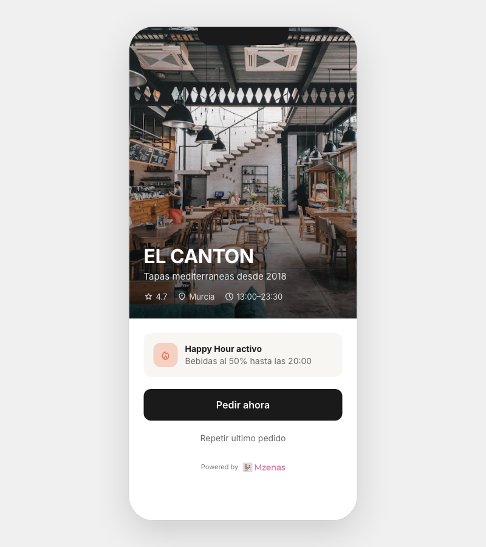
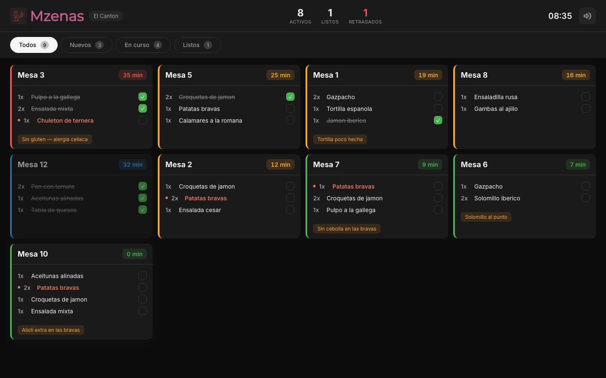
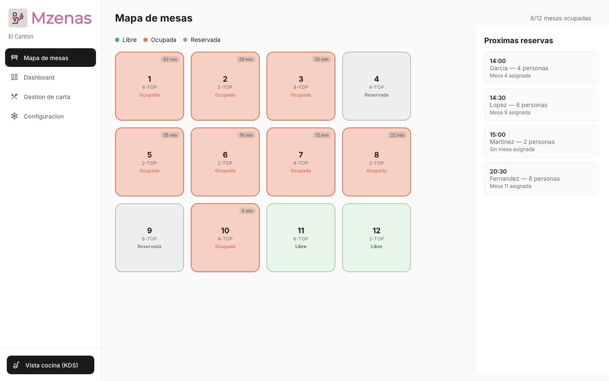
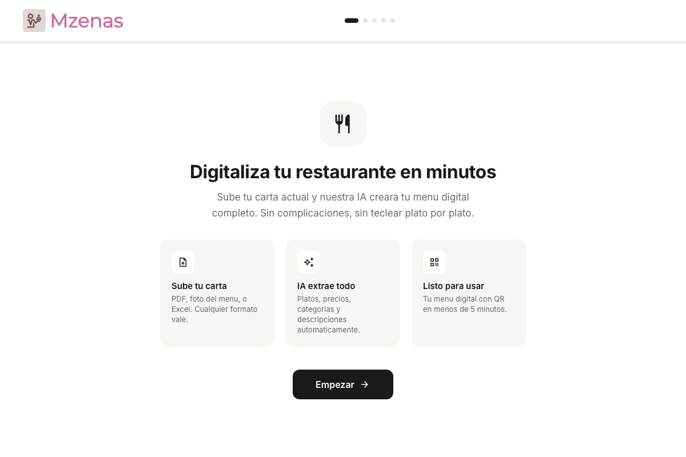

# Mzenas

Mzenas is an operating system for urban dining. It connects restaurants with customers through a single platform that handles the entire journey from scanning a QR code to settling the bill.

Restaurants get an AI-powered operations platform that eliminates friction from ordering through payment. Customers get a frictionless digital menu on their phone, with no app to download. The system reduces staffing requirements, increases table turnover by 15-20%, and gives restaurant owners real-time operational intelligence.

This repository contains interactive HTML prototypes that demonstrate the full product vision. Each file is standalone, portable, and demo-ready.

## The Product

Mzenas operates on two pillars:

**Pillar 1 -- Restaurant Operations Platform (B2B SaaS).** QR-based digital ordering, a kitchen display system, table management, integrated payments, real-time menu control, and analytics. Restaurants pay a flat EUR 99/month subscription with no per-order commission.

**Pillar 2 -- Consumer Discovery Network (B2C).** A city-wide restaurant discovery platform with AI-powered recommendations, real-time availability, and "Hot Moments" time-limited offers. This activates once a critical mass of restaurants adopt Pillar 1.

### Target Market

Independent restaurants in mid-sized Spanish cities (Murcia, Cartagena, Valencia, Alicante) that compete against large chains for visibility and foot traffic. Primary demographic: young adults (22-40), digitally native, with disposable income.

### Competitive Advantage

No current player owns the full journey from discovery to in-venue ordering to payment while building AI-driven customer profiles across both sides. TheFork stops at reservations. POS systems don't touch discovery. Mzenas bridges both.

## Interactive Prototypes

Four standalone HTML files cover every aspect of the product. Open them directly in a browser -- no build step, no dependencies beyond CDN-hosted fonts and Chart.js.

### Customer Flow (`customer-flow.html`)

The end-customer mobile experience. A diner scans the QR code at their table and orders directly from their phone.



**Screens:** Landing (post-QR scan) -> Menu with category navigation and search -> Item detail with extras, notes, and quantity -> Cart with "Dar prioridad" urgency toggle and tip selection -> Payment (Apple Pay, Google Pay, card, cash) -> Confirmation with confetti -> Live order status tracking.

**Key interactions:** Functional quantity steppers, working checkboxes for extras, editable notes field, smooth animated scroll between categories, real-time cart total calculation, simulated order status progression.

### Kitchen Display System (`restaurant-kitchen.html`)

The dark-themed kitchen view where cooks manage incoming orders in real time.



**Screens:** KDS grid with 8 color-coded order tickets (green = new, yellow = in progress, red = late) -> Slide-over detail panel with checkable items -> Mark orders as ready.

**Key interactions:** Live elapsed timers on every ticket. A 9th order (Mesa 10) animates in after 3 seconds to demonstrate real-time arrival. Click any ticket to open the detail panel, check off items individually, and mark the order complete. Filter tabs (Todos, Nuevos, En curso, Listos) filter the grid. Priority items ("Dar prioridad") appear highlighted in amber.

### Restaurant Operations (`restaurant-operations.html`)

The front-of-house management tool for restaurant owners and managers.



**Sections (sidebar navigation):**

- **Table Map** -- Visual floor plan with 12 color-coded tables (green = free, terracotta = occupied, grey = reserved). Click a table to see its order, time seated, and bill total. "Liberar mesa" frees the table instantly. Sidebar shows upcoming reservations.
- **Dashboard** -- Animated stat cards (covers, revenue, avg ticket, avg table time), Chart.js bar chart for orders per hour, popular items ranking, and a live activity feed.
- **Menu Management** -- Table view of all items with category filters and availability toggles. Toggle an item off and it shows "Agotado" instantly. Add new items via modal.
- **Configuration** -- Brand color picker with live preview, payment mode selection (al final vs. por comanda), and service toggles (turno doble, digital tips, kitchen notifications).

### AI Onboarding (`ai-onboarding.html`)

The main selling point of the restaurant onboarding flow. A restaurant owner uploads their existing menu and Mzenas creates their entire digital menu automatically.



**Flow:** Welcome screen -> Drag-and-drop file upload (PDF, photo, Excel) -> AI processing animation (~8 seconds: analyzing, extracting items in batches, organizing categories) -> Review screen with editable fields and category navigation -> "Tu menu digital esta listo!" with QR code preview.

**Key interactions:** Clickable progress dots allow navigating back and forth without losing state. All extracted item names and prices are editable inline. Category pills scroll to sections. "Ver como cliente" links to `customer-flow.html`.

## Demo Restaurant

All prototypes use **El Canton**, a fictional Mediterranean tapas bar in Murcia. The menu includes: Para picar (Patatas bravas, Croquetas de jamon, Aceitunas alinadas, Jamon iberico, Pan con tomate), Ensaladas, Tapas calientes (Pulpo a la gallega, Gambas al ajillo, Calamares a la romana), Carnes y pescados, Postres, and Bebidas.

## How to Use

**For demos:** Open any HTML file in Chrome or Safari. The customer flow renders as an iPhone-sized frame centered on screen -- present it on a phone or share your screen. The restaurant views fill the full desktop viewport.

**For customization:** Edit the JavaScript data objects at the bottom of each file to change restaurant name, menu items, prices, and table configuration. All colors use CSS custom properties defined in `:root`.

## Design System

- **Aesthetic:** Honest Greens-inspired minimalism. Black primary color, clean white surfaces, food photography as the hero. Terracotta (#E07856) reserved for warm accents (priority badges, active states).
- **Typography:** Inter font family. 8 weights from Display (28px Bold) to Caption (13px Regular).
- **Spacing:** 8px base unit. Border radius: 12px cards, 8px buttons, 24px pills.
- **Transitions:** 300ms cubic-bezier(0.4, 0, 0.2, 1) for all interactions.

## Team

- **Enrique Kessler Martinez** -- Co-founder. Amazon Software Engineer. Technical lead.
- **Dario Robles Valera** -- Co-founder. Economics graduate (University of Murcia), former commercial manager at BBVA. Originated the concept.

## Project Structure

```
customer-flow.html          End-customer mobile ordering experience
restaurant-kitchen.html     Kitchen Display System (dark theme)
restaurant-operations.html  Table map, dashboard, menu management, config
ai-onboarding.html          AI-powered menu upload and onboarding
docs/
  initial-proposal.md       Investment proposal
  honest-greens-ux-research.md  UX research and design inspiration
  screenshots/              Prototype screenshots for documentation
plans/
  demo-script.md            5-7 minute demo script with Spanish dialogue
  figma-mockups-plan.md     Original Figma design system specification
assets/
  Mzenas-logo-*.png         Logo files
```
